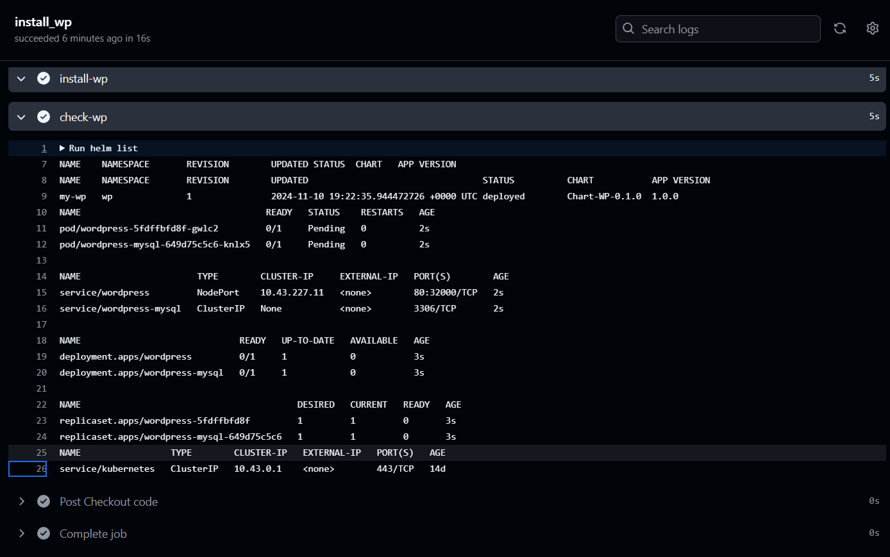

## Submission

- Provide a PR with the application and Helm chart in a new repository.
- Ensure that the application is accessible from the internet.
- Provide a PR with the CI/CD pipeline code for the application deployment.
- Provide a README file documenting the application setup and deployment process.

## Evaluation Criteria (100 points for covering all criteria)

1. **Helm Chart Creation (40 points)**

   - A Helm chart for the WordPress application is created.
     
     - https://github.com/CiscoSA/rs-wp-helm/tree/main/Chart-wp

     

2. **Application Deployment (30 points)**

   - The application is deployed using the Helm chart.
     
     https://github.com/CiscoSA/rs-wp-helm/actions/runs/11766433641/job/32773948574

     

     

   - The application is accessible from the internet.

3. **Repository Submission (5 points)**

   - A new repository is created with the WordPress and Helm chart.

     - https://github.com/CiscoSA/rs-wp-helm/tree/main/Chart-wp

     

4. **Verification (5 points)**

   - The application is verified to be running and accessible.

5. **Additional Tasks (20 points)**
   - **CI/CD Pipeline (10 points)**
     - A CI/CD pipeline is set up to automate the deployment of the application.
   - **Documentation (10 points)**
     - The application setup and deployment process are documented in a README file.

### #######################################################################################     

6. **Additional Tasks (10 points)**
   - **GitHub Actions (GHA) Pipeline (5 points)**
     - A GHA pipeline is set up to deploy Jenkins.
       
       - https://github.com/CiscoSA/rsschool-devops-course-tasks/blob/task_4/.github/workflows/deploy.yml

   - **Authentication and Security (5 points)**
     - Authentication and security settings are configured for Jenkins.
       
       

       

       

